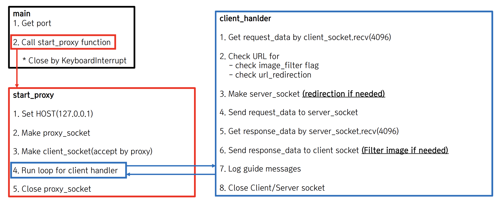

# local-proxy

## Flow chart by Psuedo code
<div align="center">
  
</div>

## How to run
```zsh
python3 proxy.py 8080
```


## Snapshots

### Mac proxy server setup

### Image filtering

### Redirection

### Environment
OS: Mac Sonoma
Language: Python(3.8.5)