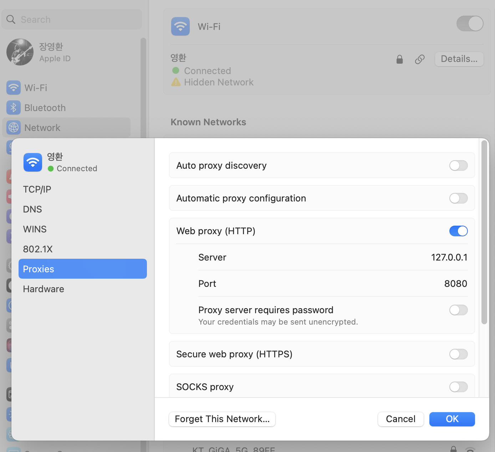
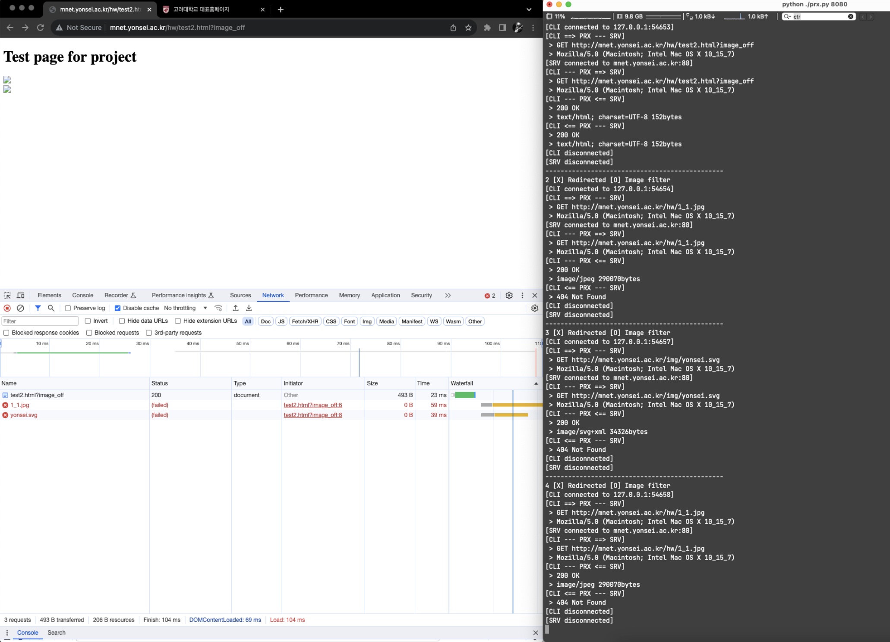
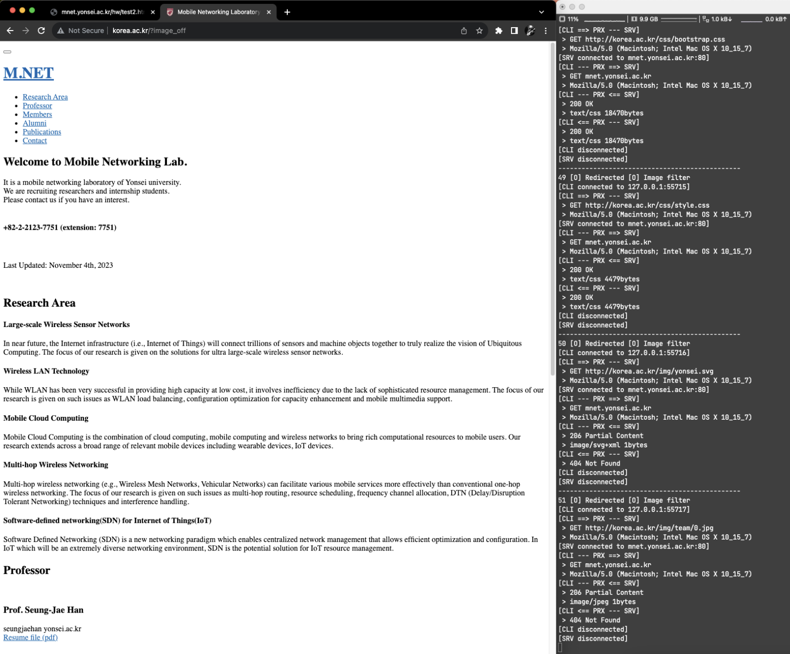

# local-proxy

## Flow chart by Psuedo code
<div align="center">
  
</div>

## How to run
Check detail proxy setting <U>[here](#mac-proxy-server-setup)</U>

```zsh
cd src
python3 proxy.py 8080
```

## How it works
**Parsing for get “User-Agent” data**  
```python
request_data_dict = {}

for line in request_data.decode().splitlines():
    try:
        title, content = line.split(": ")
        request_data_dict[title] = content
    except:
        pass

response_user_agent = request_data_dict['User-Agent']
end_index = response_user_agent.find(")")
cleaned_user_agent = response_user_agent[:end_index+1].replace("User-Agent: ", "")
```

<br/>

**Redirection to “mnet.Yonsei.ac.kr” when URL has “korea”**
```python
# Connect to the destination server
server_socket = None
response_data = None

try: 
    server_socket = socket.socket(socket.AF_INET, socket.SOCK_STREAM)
    if url_filter == "O":
        destination_host = "mnet.yonsei.ac.kr"
    server_socket.connect((destination_host,  80))
except Exception as e:
    print("\nServer socket error: " + str(e))
    

server_socket.sendall(request_data)
```

<br/>

**Image Filtering**  
Log response through proxy  
It logs also http status, content-type, content-length and send response_data to client  
<U>But It don’t send response_data when drop image</U>

```python
# Print log for the received response
print(f"[CLI <== PRX --- SRV]")

if image_filter == "O":
    if response_content.startswith("image"):
        print(f" > 404 Not Found")
    else:
        print(f" > {cleaned_status}")
        print(f" > {response_content} {response_bytes}bytes")
        client_socket.sendall(response_data)
else:
    print(f" > {cleaned_status}")
    print(f" > {response_content} {response_bytes}bytes")

    # Forward the modified response to the client
    client_socket.sendall(response_data)
```

## Snapshots

### Mac proxy server setup
<div align="center">
  
</div>

### Image filtering
**Image filtering at test page**
<div align="center">
  
</div>

### Redirection
**Redirection from Korea univ page to Yonsei univ page**
<div align="center">
  
</div>

**Image filtering with Redirection**
<div align="center">
  
</div>

## Environment
OS: Mac Sonoma  
Language: Python(3.8.5)